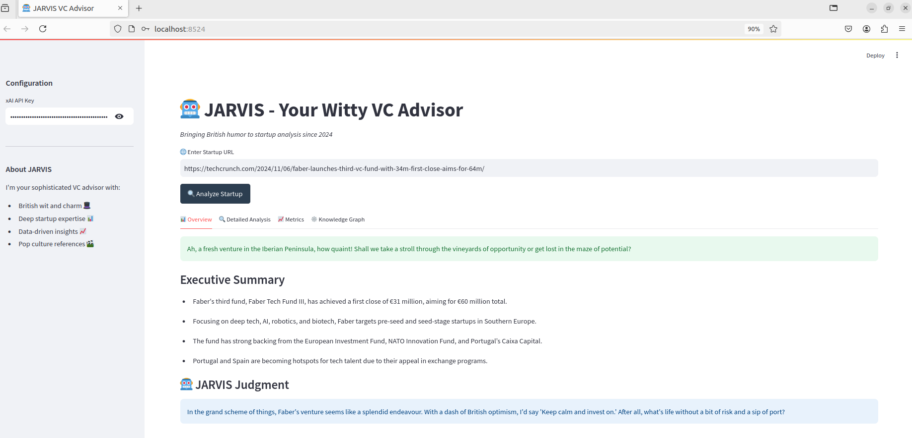
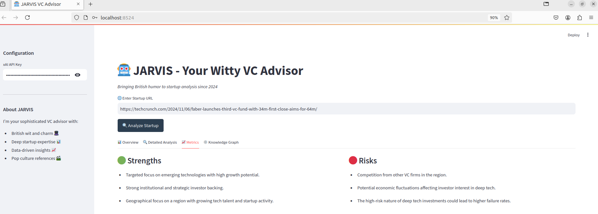
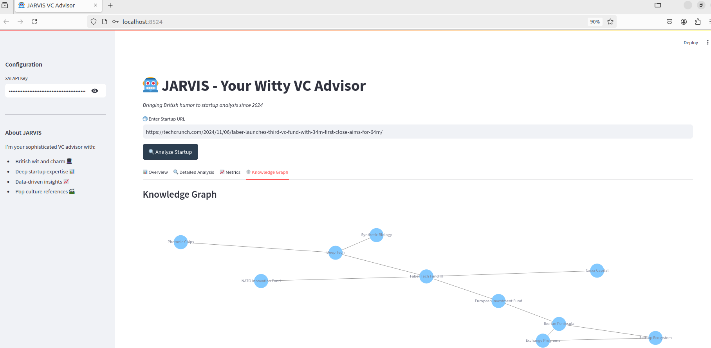

# JARVIS VC Advisor 🤖

JARVIS (Just A Rather Very Intelligent System) is a sophisticated VC advisor that combines British wit with deep startup analysis capabilities. Built with Python and powered by xAI's Grok model, JARVIS provides comprehensive startup analysis with a touch of humor.

## Features ✨

- 📊 Comprehensive startup analysis from any URL
- 🎯 Detailed metrics and risk assessment
- 🕸️ Interactive knowledge graph visualization
- 🎭 Witty British personality
- 📈 Data-driven insights with a touch of humor

## Configuration ⚙️

1. Get your xAI API key from [x.ai](https://x.ai)
2. Enter your API key in the sidebar when running JARVIS
